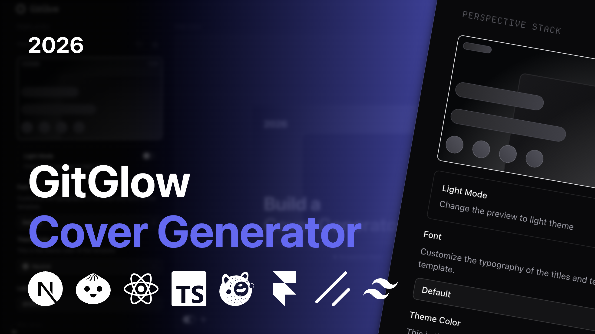

# 🌀 GitGlow: Cover Generator



**The ultimate open-source tool to craft stunning project covers in seconds** — designed for developers who care about first impressions on GitHub, YouTube, and beyond.

---

## Overview

GitGlow is a browser-based cover image generator built with **Next.js 16** and **React 19**. It provides a live, interactive editor where you pick a template, customize every visual property — colors, typography, icons, images — and export a pixel-perfect cover in PNG, JPEG, or SVG format with a single keystroke.

No design skills required. No Figma. Just open the app, tweak, and export.

---

## Features

- **🎨 Multi-template library**: Choose from categorized cover templates organized by style category.
- **⚡ Real-time live preview**: Every change is reflected instantly in the preview canvas, scaled to fit your viewport.
- **🖼️ Multi-format export**: Download your cover as **PNG**, **JPEG**, or **SVG** in high quality. Trigger the export with the `E` keyboard shortcut.
- **🔠 Google Fonts picker**: Browse and apply any Google Font directly in the editor. Fonts are fetched via the Google Fonts API, cached for 24 hours, and **embedded as data URLs** in the exported file for full offline fidelity.
- **🎭 3D animated preview**: The preview card reacts to mouse movement with a spring-based 3D tilt effect (Framer Motion). Toggle the animation on or off at any time.
- **🌓 Dual theme preview**: Switch the app between dark and light mode, and independently toggle the preview canvas between light and dark rendering.
- **🎛️ Per-template field system**: Each template exposes its own typed fields — text, textarea, color picker, icon selector, image upload, combobox, and select — all managed through a unified settings panel.
- **🖌️ Custom color theming**: Pick any accent color to drive the template's theme using the built-in color input.
- **🔣 Icon picker**: Add Simple Icons directly into your cover design, with drag-and-drop reordering powered by `@dnd-kit`.
- **📁 Image upload**: Upload your own custom screenshots or visuals directly into supported templates.
- **🔍 Zoom control**: Zoom the preview in and out with smooth spring animation to inspect details at any scale.
- **↩️ Reset controls**: Reset all fields to their template defaults or wipe them entirely with dedicated action buttons.
- **📱 Responsive layout**: The editor adapts gracefully to mobile viewports, disabling 3D tilt interactions on touch devices.

---

## Project Structure

```
gitglow/
├── app/                        # Next.js App Router (layout, page)
├── components/
│   ├── Header/                 # App header: logo, theme toggle, GitHub stars
│   ├── Input/                  # Field input primitives (Color, Font, Icon, Image)
│   ├── Preview/                # Preview canvas, export button, zoom, animation toggle
│   ├── Settings/               # Settings panel: template list, form, reset actions
│   └── ui/                     # Base UI components (shadcn + custom)
├── data/
│   ├── template-definitions.ts # Template schema and field type definitions
│   └── templates.tsx           # Template components and category registry
├── hooks/
│   ├── useCover.ts             # Global Zustand store for all editor state
│   ├── useCurrentTemplate.ts   # Resolves the active template component
│   └── ...                     # Utility hooks (media query, mobile, confirm)
├── lib/
│   ├── fonts.ts                # Google Fonts API client with 24h cache + embed CSS
│   ├── keyboard-shortcut.ts    # Keyboard shortcut handler factory
│   └── utils.ts                # cn() and general utilities
├── provider/
│   └── theme-provider.tsx      # next-themes provider
└── public/
    └── templates/              # Pre-rendered SVG previews (dark + light variants)
```

---

## Getting Started

### Prerequisites

- **Bun** >= 1.0 ([install](https://bun.sh))
- A **Google Fonts API key** ([get one here](https://developers.google.com/fonts/docs/developer_api))

### Installation

```bash
git clone https://github.com/LenySauzet/gitglow.git
cd gitglow
bun install
```

### Environment Variables

Copy the example file and fill in your API key:

```bash
cp .env.example .env.local
```

`.env.local`:

```env
NEXT_PUBLIC_GOOGLE_FONTS_API_KEY="your-google-fonts-api-key"
```

> The Google Fonts API key is required to populate the font picker. Without it, font selection will not work, but the rest of the editor remains fully functional.

### Development

```bash
bun dev
```

The app is available at [http://localhost:3000](http://localhost:3000).

### Build

```bash
bun run build
bun start
```

---

## Contributing

Contributions are welcome. If you find a bug, have a feature idea, or want to add a new template, feel free to:

1. **Open an issue** to discuss the change before starting work.
2. **Fork the repository** and create a feature branch.
3. **Submit a pull request** with a clear description of what was changed and why.

Please keep PRs focused and scoped to a single concern. Code style follows the existing ESLint and TypeScript configuration.

---

## License

This project is licensed under the **[MIT License](LICENSE)**.

---

<picture>
  <source media="(prefers-color-scheme: dark)" srcset="https://github.com/user-attachments/assets/fc697ecb-2829-4bbc-95cb-8bfa72b72db6">
  <source media="(prefers-color-scheme: light)" srcset="https://github.com/user-attachments/assets/ba95e261-440c-4c24-ac95-e1ba26a650d9">
  
</picture>

<div align="center">
  
  <br/>
  
  
  
</div>
